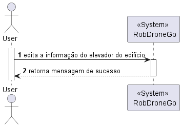

 US200 - Edita informação do piso do edifício
=================================================================

# Design Arquitetural

## Nível 1

### Nível 1 - Vista Lógica

## Nível 1 - Vista de Processo

## Nível 2

## Nível 2 - Vista Lógica

## Nível 2 - Vista de Implementação

## Nível 3 (Master Data Rede)

## Nível 3 - Vista Lógica

## Nível 3 - Vista de Processo

### Nesta vista de implementação o X representa o Elevator

## Nível 3 - Vista de Implementação
