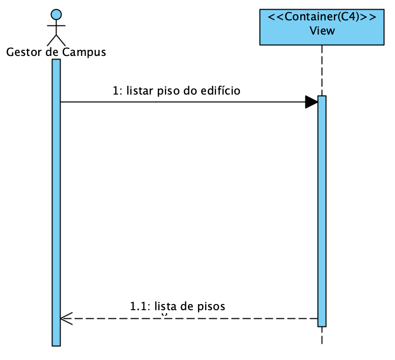
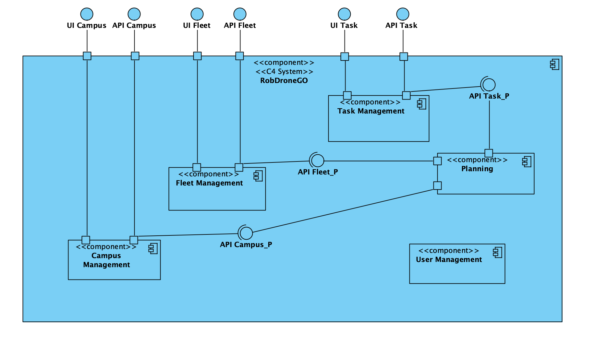
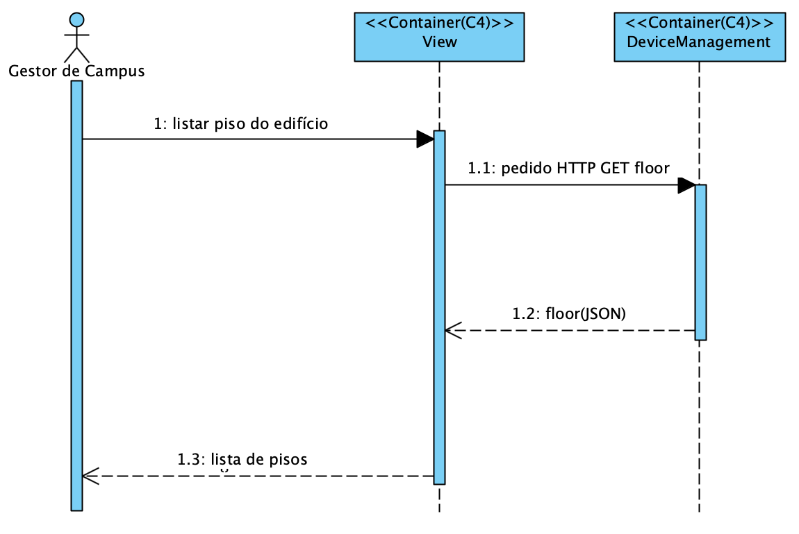
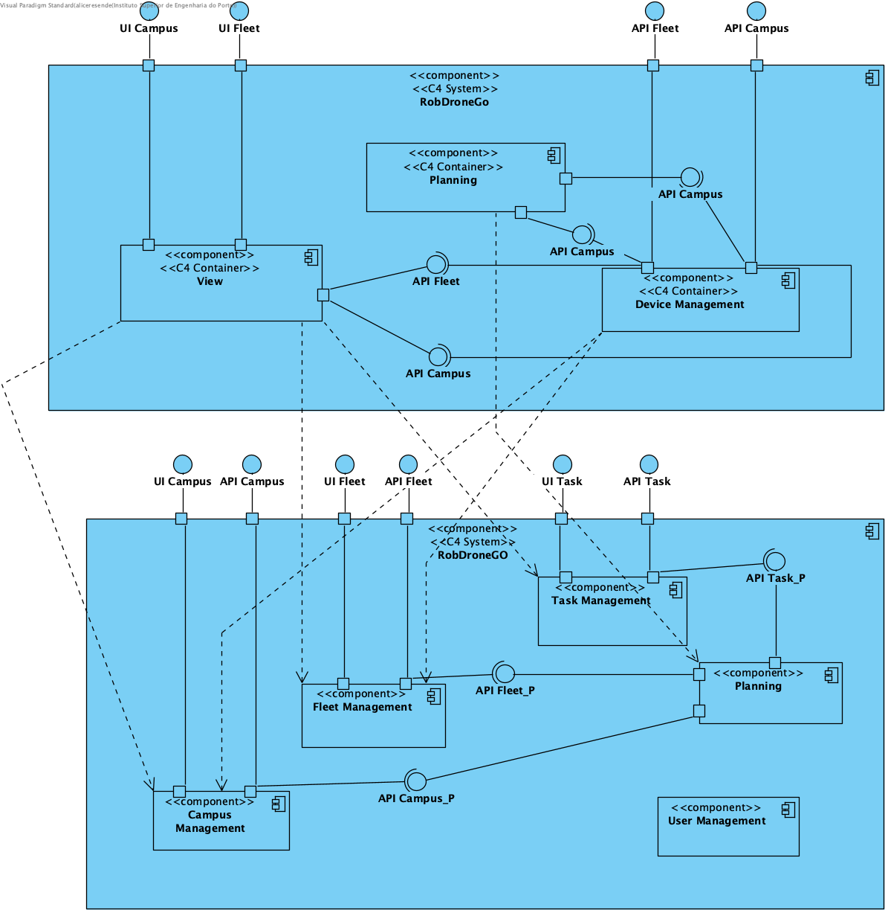
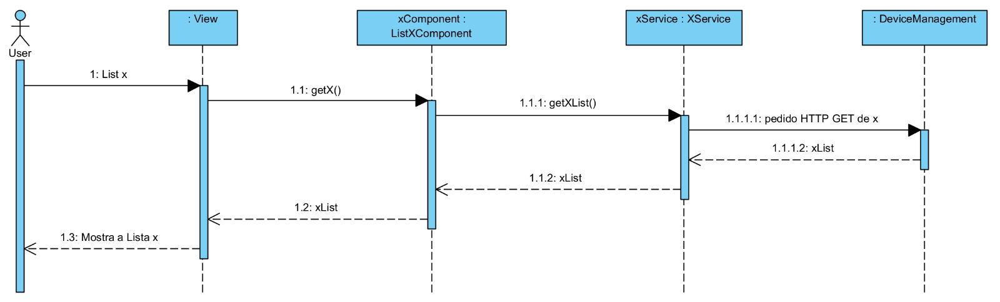
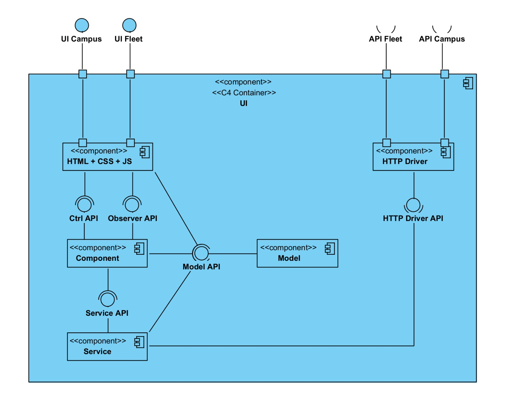

 US1100 - Como gestor de Campus, quero listar edifícios com min e max de pisos
=================================================================

# Design Arquitetural

## Nível 1

### Nível 1 - Vista Lógica

## Nível 1 - Vista de Processo

## Nível 2

## Nível 2 - Vista Lógica

## Nível 2 - Vista de Processo

## Nível 2 - Vista de Implementação

](../../Nivel2/N2VI.png)

## Nível 2 - Mapeamento: Vista Lógica - Vista Implementação

## Nível 3 (View)

## Nível 3 - Vista Lógica

## Nível 3 - Vista de Processo

### Nesta vista de implementação o X representa o Floor

## Nível 3 - Vista de Implementação

## Nível 3 - Mapeamento: Vista Lógica - Vista Implementação
