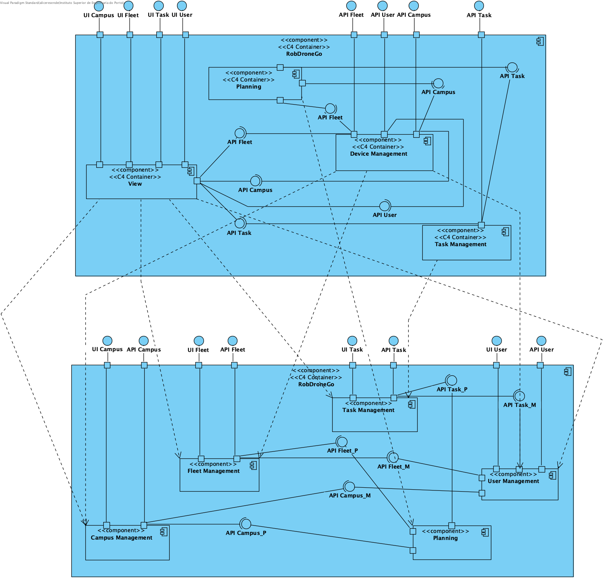
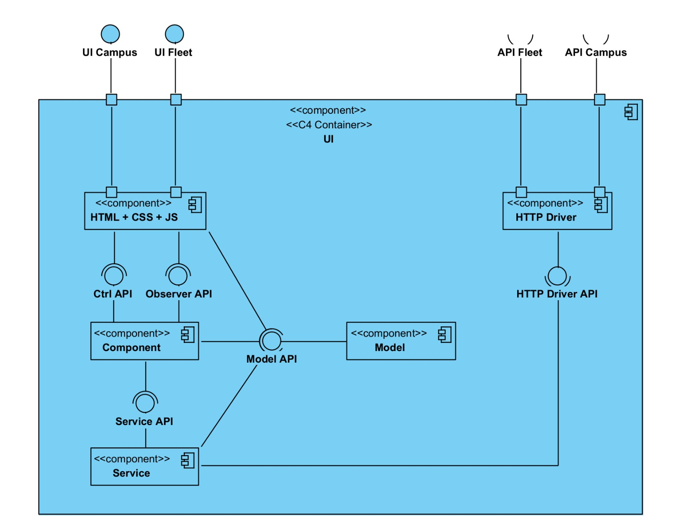

 US480 - Como gestor de tarefas pretendo consultar as requisições de tarefas ainda não aprovadas
=================================================================

# Design Arquitetural

## Nível 1

### Nível 1 - Vista Lógica

## Nível 1 - Vista de Processo

## Nível 2

## Nível 2 - Vista Lógica

## Nível 2 - Vista de Processo

## Nível 2 - Vista de Implementação

## Nível 2 - Mapeamento: Vista Lógica - Vista Implementação

## Nível 3 (View)

## Nível 3 - Vista Lógica (View)

## Nível 3 - Vista Lógica (Task Management)

## Nível 3 - Vistas de Processo

Nesta vista de implementação o X representa Vigilance ou PickUpDelivery dependendo do tipo de tarefa que se pretende criar

## Nível 3 - Vista de Implementação (View)

## Nível 3 - Vista de Implementação (Task Management)

## Nível 3 - Mapeamento: Vista Lógica - Vista Implementação (View)
